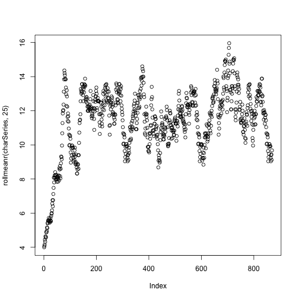

Language in Time - Chapter 1 - Rudiments
========================================================

To begin, let's get some data. We will start the manual with what is recognized as a sort of tradition in recurrence quantification of text. In the early 2000's, a demonstration of recurrence applied to text was conducted using Dr. Seuss' Green Eggs and Ham. Its small number of unique words (50) and characteristic weaving of rhyme and repetition make it a useful first demonstration. We uphold this tradition here.
 

```r
setwd('~/Dropbox/RecurrenceRecipes')
options(warn = -1)
library(crqa)
```

```
## Loading required package: Matrix
## Loading required package: tseriesChaos
## Loading required package: deSolve
## Loading required package: fields
## Loading required package: spam
## Loading required package: grid
## Spam version 0.40-0 (2013-09-11) is loaded.
## Type 'help( Spam)' or 'demo( spam)' for a short introduction 
## and overview of this package.
## Help for individual functions is also obtained by adding the
## suffix '.spam' to the function name, e.g. 'help( chol.spam)'.
## 
## Attaching package: 'spam'
## 
## The following object is masked from 'package:base':
## 
##     backsolve, forwardsolve
## 
## Loading required package: maps
```

```r
library(tm)
rawText = readChar('data/Sam I Am.txt',
  file.info('data/Sam I Am.txt')$size)
```

Once we have these data, let us convert them at the character level.


```r
chars = unlist(strsplit(rawText, ""))
uniqChars = unique(chars)
charSeries = as.vector(sapply(chars,function(x) {
  which(x == uniqChars)
}))
```

Our sequence of characters, encoded with unique identifiers.


```r
plot(charSeries,type='l')
```

 

Note that we convert characters to a series of nominal codes. These numeric codes represent the character types, and converting the characters to numeric codes allows us to utilize all the standard `crqa` library functions for reasons that will become quite clear below. 

The core data structure that underlies all recurrence quantification is the recurrence plot (RP). Let's define it with respect to our character time series. A recurrence plot (RP) is the set of points (i,j) such that `charSeries[i]==charSeries[j]`. Building it with the `crqa` library is quite easy. 


```r
crqaResults  = crqa(charSeries,charSeries,1,3,1,.0001,F,2,2,0,F,F) # we'll explain parameters later
RP = 1*as.matrix(crqaResults$RP) # convert into numeric non-sparse matrix
ij = which(RP==1,arr.ind=T) # get coordinates
plot(ij[,1],ij[,2],
     xlab='time (character)',ylab='time (character)',pch=15,cex=.5)
```

 

So the RP is just a collection of points representing the instances at which the 
"system" (here, Theodor Geisel, I guess) is revisiting particular states that we are
interested in (in this case, characters). To get a sense of how this works,
let's grab the especially repetitive sequencing taking place about midway into
Green Eggs and Ham.


```r
crqaResults  = crqa(charSeries[460:535],charSeries[460:535],1,1,1,.0001,F,2,2,0,F,F) # we'll explain parameters later
RP = 1*as.matrix(crqaResults$RP) # convert into numeric non-sparse matrix
ij = which(RP==1,arr.ind=T) # get coordinates
plot(ij[,1],ij[,2],
     xlab='time (character)',ylab='time (character)',
     pch=15,cex=.5,col=rgb(.8,.8,.8))
text(ij[,1],ij[,2],chars[ij[,1]+458],cex=.8)
```

 


